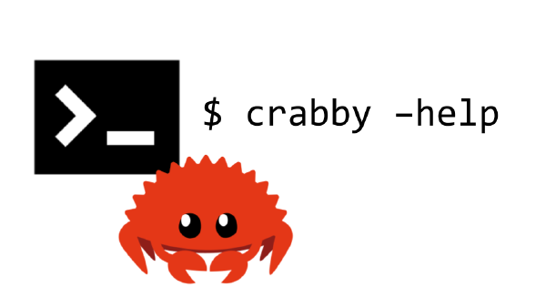

# Learn Rust by building Command Line Application

Repository used for workshop

## What we will build

🦀 Crabby command line !

```
$ crabby --help

crabby 0.1.0
I am the crabby help usage.

USAGE:
    crabby <SUBCOMMAND>

FLAGS:
    -h, --help       Prints help information
    -V, --version    Prints version information

SUBCOMMANDS:
    greets    Say my name !
    help      Prints this message or the help of the given subcommand(s)
    learn     I can learn things

```

## Requirements

You'll need to install:

- [Rust](https://www.rust-lang.org/tools/install)

TLDR 

```bash
curl --proto '=https' --tlsv1.2 -sSf https://sh.rustup.rs | sh
```


### Verify your toolchain version

Minimum Version : 1.63+

```bash
rustc --version
```


## Instructions 


* [Part 1 - Env setup](./1_setup) 
* [Part 2 - Syntax](./2_syntax)
* [Part 3 - Command args and options](./3_args)
* [Part 4 - Better command help documenter son application](./4_documentation)
* [Part 5 - Api call with Json parsing](./5_api)

